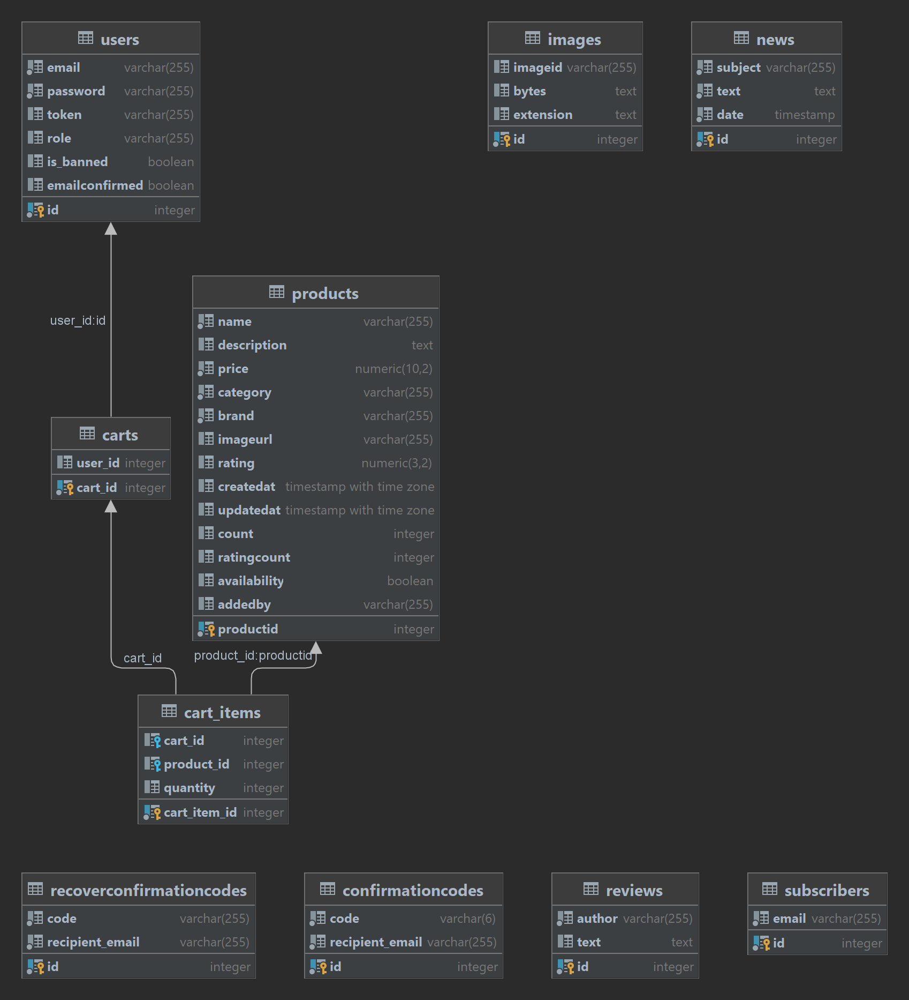

# https://beb-web.onrender.com/app/index

<p align="center">
  <a href="http://nestjs.com/" target="blank"></a>
</p>

[circleci-image]: https://img.shields.io/circleci/build/github/nestjs/nest/master?token=abc123def456
[circleci-url]: https://circleci.com/gh/nestjs/nest

  <p align="center">A progressive <a href="http://nodejs.org" target="_blank">Node.js</a> framework for building efficient and scalable server-side applications.</p>
    <p align="center">
<a href="https://www.npmjs.com/~nestjscore" target="_blank"></a>
<a href="https://www.npmjs.com/~nestjscore" target="_blank"></a>
<a href="https://www.npmjs.com/~nestjscore" target="_blank"></a>
<a href="https://circleci.com/gh/nestjs/nest" target="_blank"></a>
<a href="https://coveralls.io/github/nestjs/nest?branch=master" target="_blank"></a>
<a href="https://discord.gg/G7Qnnhy" target="_blank"></a>
<a href="https://opencollective.com/nest#backer" target="_blank"></a>
<a href="https://opencollective.com/nest#sponsor" target="_blank"></a>
  <a href="https://paypal.me/kamilmysliwiec" target="_blank"></a>
    <a href="https://opencollective.com/nest#sponsor"  target="_blank"></a>
  <a href="https://twitter.com/nestframework" target="_blank"></a>
</p>
  <!--[](https://opencollective.com/nest#backer)
  [](https://opencollective.com/nest#sponsor)-->

## Description

[Nest](https://github.com/nestjs/nest) framework TypeScript starter repository.

## Installation

```bash
$ npm install
```

## Running the app

```bash
# development
$ npm run start

# watch mode
$ npm run start:dev

# production mode
$ npm run start:prod
```

## Test

```bash
# unit tests
$ npm run test

# e2e tests
$ npm run test:e2e

# test coverage
$ npm run test:cov
```

## Support

Nest is an MIT-licensed open source project. It can grow thanks to the sponsors and support by the amazing backers. If you'd like to join them, please [read more here](https://docs.nestjs.com/support).

## Stay in touch

- Author - [Kamil Myśliwiec](https://kamilmysliwiec.com)
- Website - [https://nestjs.com](https://nestjs.com/)
- Twitter - [@nestframework](https://twitter.com/nestframework)

## License

Nest is [MIT licensed](LICENSE).

<a></a>
# Схема базы данных

## Таблица `cart_items`

- `cart_id`: Идентификатор корзины, к которой относится товар (целое число).
- `product_id`: Идентификатор товара (целое число).
- `quantity`: Количество товара в корзине (целое число).
- `cart_item_id`: Идентификатор элемента корзины (целое число).

## Таблица `carts`

- `user_id`: Идентификатор владельца корзины (целое число).
- `cart_id`: Идентификатор корзины (целое число).

## Таблица `confirmationcodes`

- `code`: Код подтверждения (строка, длиной 6 символов).
- `recipient_email`: Email-адрес получателя кода (строка, до 255 символов).
- `id`: Идентификатор кода подтверждения (целое число).

## Таблица `images`

- `imageid`: Идентификатор изображения (строка, до 255 символов).
- `bytes`: Данные изображения (текст).
- `extension`: Расширение изображения (текст).
- `id`: Идентификатор изображения (целое число).

## Таблица `news`

- `subject`: Тема новости (строка, до 255 символов).
- `text`: Текст новости (текст).
- `date`: Дата публикации новости (временная метка).
- `id`: Идентификатор новости (целое число).

## Таблица `products`

- `name`: Наименование товара (строка, до 255 символов).
- `description`: Описание товара (текст).
- `price`: Цена товара (число с фиксированной точкой, 10 знаков перед запятой, 2 знака после).
- `category`: Категория товара (строка, до 255 символов).
- `brand`: Бренд товара (строка, до 255 символов).
- `imageurl`: URL изображения товара (строка, до 255 символов).
- `rating`: Рейтинг товара (число с фиксированной точкой, 3 знака перед запятой, 2 знака после).
- `createdat`: Дата создания товара (временная метка с часовым поясом).
- `updatedat`: Дата обновления товара (временная метка с часовым поясом).
- `count`: Количество товара (целое число).
- `ratingcount`: Количество оценок товара (целое число).
- `availability`: Наличие товара (логическое значение).
- `addedby`: Пользователь, добавивший товар (строка, до 255 символов).
- `productid`: Идентификатор товара (целое число).

## Таблица `recoverconfirmationcodes`

- `code`: Код восстановления (строка, до 255 символов).
- `recipient_email`: Email-адрес получателя кода (строка, до 255 символов).
- `id`: Идентификатор кода восстановления (целое число).

## Таблица `reviews`

- `author`: Автор отзыва (строка, до 255 символов).
- `text`: Текст отзыва (текст).
- `id`: Идентификатор отзыва (целое число).

## Таблица `subscribers`

- `email`: Email-адрес подписчика (строка, до 255 символов).
- `id`: Идентификатор подписчика (целое число).

## Таблица `users`

- `email`: Email-адрес пользователя (строка, до 255 символов).
- `password`: Пароль пользователя (строка, до 255 символов).
- `token`: Токен пользователя (строка, до 255 символов).
- `role`: Роль пользователя (строка, до 255 символов).
- `is_banned`: Заблокирован ли пользователь (логическое значение).
- `emailconfirmed`: Подтвержден ли email пользователя (логическое значение).
- `id`: Идентификатор пользователя (целое число).

